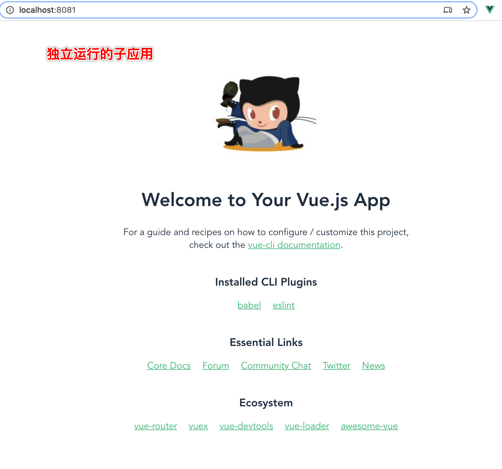
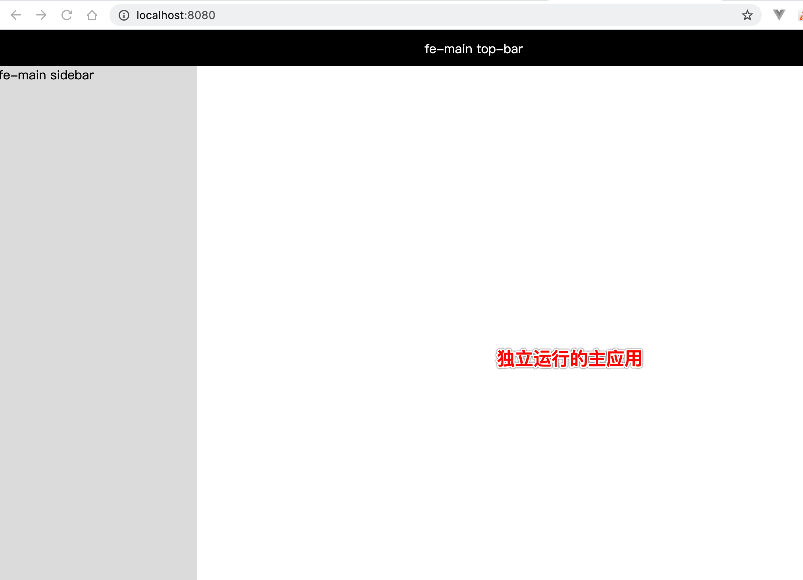
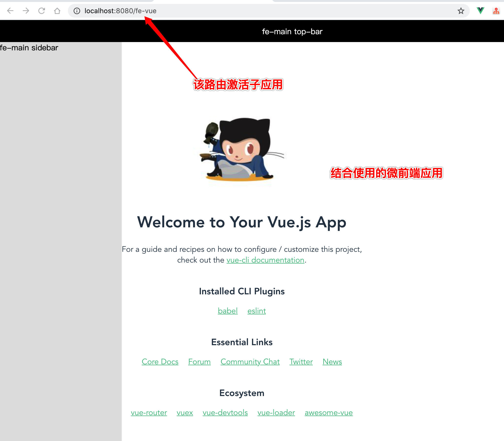

# 使用mono-repo实践各技术框架
## 实践技术概览
- Lerna【monorepo解决方案】：https://github.com/lerna/lerna
- Qiankun【微前端解决方案】：https://qiankun.umijs.org/zh/guide/getting-started
- VueJS【广泛使用的前端框架】：https://cn.vuejs.org/v2/guide/
- MidwayJS【基于EggJS的上层node框架】：https://midwayjs.org/midway/guide.html#%E5%BF%AB%E9%80%9F%E4%B8%8A%E6%89%8B

## Lerna： monorepo管理
### 基础命令
- lerna init：新建monorepo
- lerna bootstrap：安装所有子应用依赖
- lerna create [subapp]：新建子应用
### packages
- fe-main（qiankun）
- fe-vue（vuejs + qiankun子应用）
- server-midway（midwayjs）

## Qiankun： 微前端方案
### 使用示例：
1. 分别运行主子应用，主应用在8080端口、子应用在8081端口

2. 独立运行的子应用

3. 独立运行的主应用

4. 结合使用微前端
